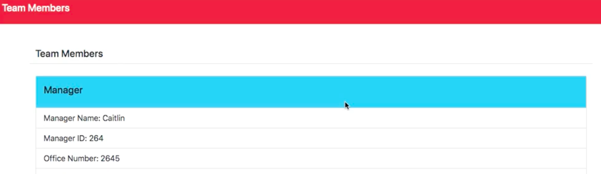

# Team Profile Generator

## Table of Contents

- [Picture](#picture)
- [Description](#description)
- [License](#license)
- [Installation](#installation)
- [Usage](#usage)

## Picture

## Description

This is a command line application that takes the user's input for information about each member of a team - a manager, engineers, and interns - and arranges it into an HTML document.

## License

None

## Installation

The application is run through Node.js and uses the Inquirer npm, and Jest to run the tests.

## Usage

The user runs the application through the command line and answers the questions, and the file is automatically generated.

## Video demonstration

https://youtu.be/-BrFrWT9qNU